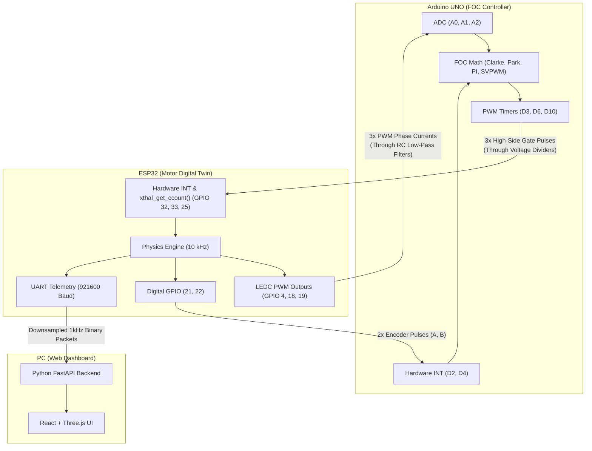
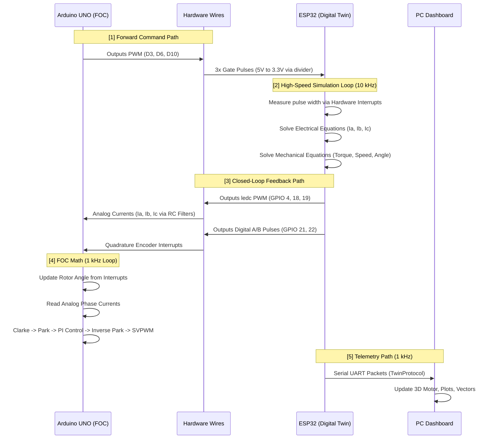

# Complete Project Architecture
**Hardware-in-the-Loop (HIL) Digital Twin FOC System**



---

## Detailed Data Flow Diagram



---

## Software Architecture

### Arduino UNO (FOC Controller)
Runs a 1 kHz closed-loop execution timer inside the main loop.
1. **`isr_encA()` & `ISR(PCINT2_vect)`**: Track mechanical rotor position constantly in the background.
2. **`readInputs()`**: Samples A0, A1, A2, and scales the 0-3.3V ESP32 analog signal into `Amps`. Converts encoder ticks into electrical angle `theta`.
3. **`clarke()` & `park()`**: Translates 3-phase AC currents into DC D/Q currents.
4. **`currentPI()`**: Compares `Id` and `Iq` against target setpoints and computes the necessary `Vd` and `Vq` voltages to correct the error.
5. **`inversePark()`**: Translates D/Q voltages back into 2-phase alpha/beta stationary frame.
6. **`SVPWM()`**: Injects third-harmonic vectors and calculates exact duty cycles, loading them directly into `OCR0A`, `OCR1A`, and `OCR2B` hardware timer registers.

### ESP32 (Motor Emulator)
Runs a highly optimized 10 kHz (100 µs) physics loop on Core 1.
1. **Hardware Interrupts**: 3x `CHANGE` interrupts trigger on any incoming PWM edge. They use the ESP32 internal 240MHz cycle counter (`xthal_get_ccount()`) to calculate the exact duty cycle with 15-bit nanosecond precision.
2. **`Inverter.cpp`**: Takes the 3 duty cycles and multiplies by bus voltage to compute `Va`, `Vb`, `Vc`.
3. **`ElectricalModel.cpp`**: Solves differential equations to calculate `Ia`, `Ib`, `Ic` based on phase voltages, back EMF, resistance, and inductance.
4. **`TorqueModel.cpp`**: Computes the electromagnetic torque.
5. **`MechanicalModel.cpp`**: Solves inertia and friction equations to update rotor speed and angle.
6. **Output Stage**:
   - `Ia, Ib, Ic` are mapped to 8-bit values and written to 39 kHz hardware PWM channels (`ledcWrite`).
   - The rotor angle is passed to `Encoder.cpp`, which calculates A/B/Z states and writes them to digital GPIO pins.
7. **Telemetry**: Once every 10 loops (1 kHz), the ESP32 packages the internal state and blasts it over UART to the Python backend.

---

## Folder Structure

```text
Project_Root/
├── FOC_Controller/                 # Arduino UNO Code
│   └── FOC_Controller.ino          # Complete FOC logic + Encoder Interrupts
│
├── firmware/                       # ESP32 Digital Twin Code
│   ├── firmware.ino                # 10kHz Main Loop, Interrupts, LEDC Output
│   └── src/
│       ├── main/
│       │   ├── DigitalTwin.h       # Aggregates all physics models
│       │   └── DigitalTwin.cpp     # 10kHz step() pipeline
│       ├── electrical/
│       │   ├── ElectricalModel.cpp # V = I*R + L*(di/dt) + EMF
│       │   └── Inverter.cpp        # Duty Cycle -> Phase Voltage
│       ├── mechanical/
│       │   └── MechanicalModel.cpp # T = J*(dw/dt) + B*w
│       ├── simulation/
│       │   └── TorqueModel.cpp     
│       ├── sensors/
│       │   └── Encoder.cpp         # Rotor Angle -> A/B Pulses
│       ├── faults/
│       │   └── FaultManager.cpp    # Injects failures dynamically
│       └── communication/
│           └── TwinLink.cpp        # 921600 Baud Binary Protocol
│
├── backend/                        # Python FastApi server (Reads UART)
├── frontend/                       # React & Three.js (3D Visualization)
└── walkthrough.md                  # Wiring Instructions
```
