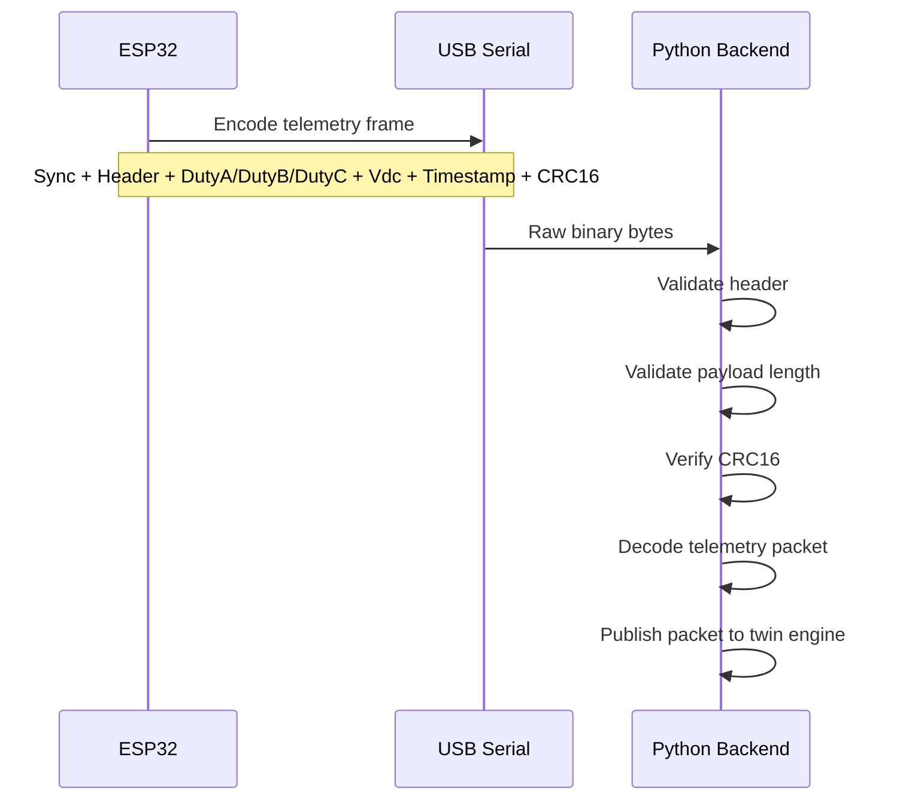
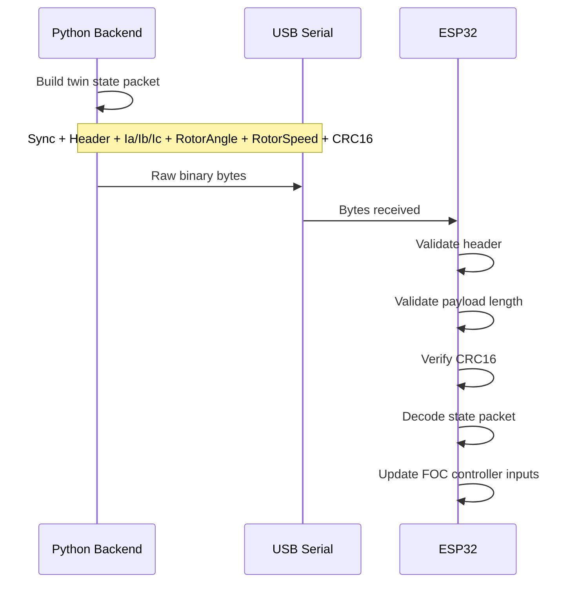
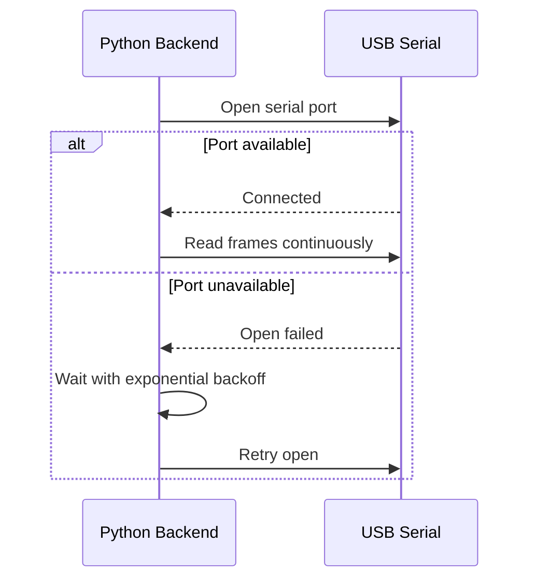

# USB Protocol Sequence Diagrams

## ESP32 Telemetry to Python Backend

```mermaid
sequenceDiagram
    participant ESP32
    participant USB as USB Serial
    participant PY as Python Backend

    ESP32->>USB: Encode telemetry frame
    Note over ESP32,USB: Sync + Header + DutyA/DutyB/DutyC + Vdc + Timestamp + CRC16
    USB->>PY: Raw binary bytes
    PY->>PY: Validate header
    PY->>PY: Validate payload length
    PY->>PY: Verify CRC16
    PY->>PY: Decode telemetry packet
    PY->>PY: Publish packet to twin engine
```

## Python Twin State to ESP32

```mermaid
sequenceDiagram
    participant PY as Python Backend
    participant USB as USB Serial
    participant ESP32

    PY->>PY: Build twin state packet
    Note over PY,USB: Sync + Header + Ia/Ib/Ic + RotorAngle + RotorSpeed + CRC16
    PY->>USB: Raw binary bytes
    USB->>ESP32: Bytes received
    ESP32->>ESP32: Validate header
    ESP32->>ESP32: Validate payload length
    ESP32->>ESP32: Verify CRC16
    ESP32->>ESP32: Decode state packet
    ESP32->>ESP32: Update FOC controller inputs
```

## Reconnect Flow

```mermaid
sequenceDiagram
    participant PY as Python Backend
    participant USB as USB Serial

    PY->>USB: Open serial port
    alt Port available
        USB-->>PY: Connected
        PY->>USB: Read frames continuously
    else Port unavailable
        USB-->>PY: Open failed
        PY->>PY: Wait with exponential backoff
        PY->>USB: Retry open
    end
```

